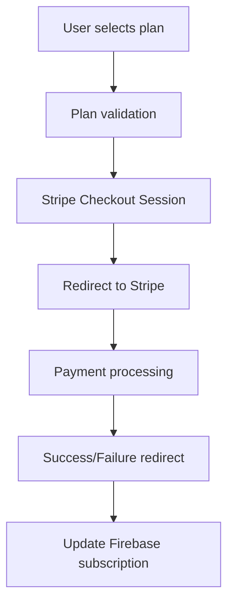
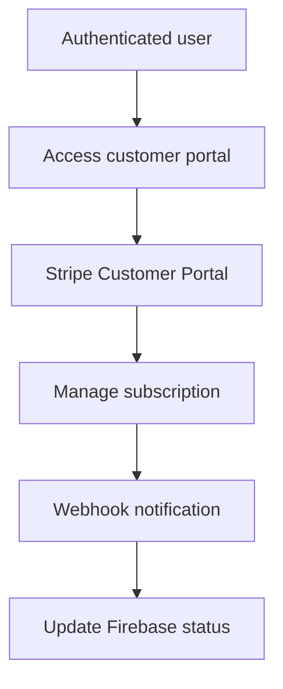

# Stripe Subscription Implementation Strategy
## IELTS Practice Module Payment Integration

### 📋 Overview
This document outlines the strategic implementation of Stripe subscription payments for the IELTS Practice Module, maintaining the HTML-only architecture while providing secure, live payment processing capabilities.

---

## 🎯 Implementation Goals

### Primary Objectives
- **Live Payment Processing**: Real Stripe integration with test cards during development
- **Subscription Management**: Weekly, Monthly, and Quarterly plans
- **HTML-Only Architecture**: No separate backend required
- **Security Compliance**: PCI-DSS compliant payment handling
- **User Experience**: Seamless payment flow integrated with existing UI

### Success Metrics
- Secure payment processing with 99.9% uptime
- <3 second payment form load time
- Mobile-responsive payment experience
- Automatic subscription management and renewals

---

## 🔧 Technical Architecture

### Core Integration Approach
```
Frontend (HTML/JS) → Stripe Checkout/Elements → Stripe API → Firebase (User Management)
```

### Key Components
1. **Stripe Checkout Session** - Hosted payment pages
2. **Stripe Elements** - Embedded payment forms
3. **Stripe Customer Portal** - Subscription management
4. **Firebase Integration** - User subscription status tracking
5. **Webhook Handling** - Payment event processing

---

## 🔑 Stripe Configuration

### Test Environment Setup
```javascript
// Test API Keys (Provided by you later)
const STRIPE_TEST_PUBLISHABLE_KEY = "pk_test_..."; // Client-side key
const STRIPE_TEST_SECRET_KEY = "sk_test_...";      // Server-side key (webhook)
const STRIPE_TEST_WEBHOOK_SECRET = "whsec_...";     // Webhook endpoint secret
```

### Product Configuration
```javascript
// Subscription Plans (Test Environment)
const SUBSCRIPTION_PLANS = {
    weekly: {
        priceId: "price_test_weekly_plan",
        amount: 499,          // $4.99 CAD
        currency: "cad",
        interval: "week"
    },
    monthly: {
        priceId: "price_test_monthly_plan", 
        amount: 1499,         // $14.99 CAD
        currency: "cad",
        interval: "month"
    },
    quarterly: {
        priceId: "price_test_quarterly_plan",
        amount: 2999,         // $29.99 CAD
        currency: "cad",
        interval: "month",
        intervalCount: 3
    }
};
```

---

## 📅 Firebase Field Update Requirements

### Specific Field Updates on Successful Payment

When a user completes payment, the following Firebase fields must be updated in the user's document:

#### 1. Date_Subscription_Start
- **Source**: Current date from web API
- **Processing**: Convert to UTC-4 timezone
- **Format**: Firebase Timestamp object
- **Example**: `2024-12-20T10:30:00-04:00`

#### 2. Subscription
- **Value**: `"Y"` (String)
- **Purpose**: Indicates active subscription status

#### 3. Date_Subscription_End  
- **Calculation**: Date_Subscription_Start + Plan Duration
- **Plan Durations**:
  - Weekly: +7 days
  - Monthly: +30 days  
  - Quarterly: +90 days
- **Format**: Firebase Timestamp object (UTC-4)

#### 4. Plan
- **Values**: `"Weekly"`, `"Monthly"`, or `"Quarterly"`
- **Source**: Selected plan from payment form
- **Type**: String (exact case matching)

#### 5. Amount
- **Value**: Amount paid by user (in cents)
- **Examples**: 
  - Weekly: `499` ($4.99 CAD)
  - Monthly: `1499` ($14.99 CAD)
  - Quarterly: `2999` ($29.99 CAD)
- **Type**: Number

### UTC-4 Timezone Conversion Logic

```javascript
// Get current date from web API in UTC-4
async function getCurrentDateInUTC4() {
    try {
        // Option 1: Use WorldTimeAPI for accurate UTC-4 time
        const response = await fetch('https://worldtimeapi.org/api/timezone/America/New_York');
        const timeData = await response.json();
        return new Date(timeData.datetime);
    } catch (error) {
        // Fallback: Convert system time to UTC-4
        const systemTime = new Date();
        const utc4Time = new Date(systemTime.getTime() - (4 * 60 * 60 * 1000));
        return utc4Time;
    }
}

// Calculate subscription end date based on plan
function calculateEndDate(startDate, planType) {
    const endDate = new Date(startDate);
    
    switch (planType) {
        case 'weekly':
            endDate.setDate(endDate.getDate() + 7);
            break;
        case 'monthly':
            endDate.setDate(endDate.getDate() + 30);
            break;
        case 'quarterly':
            endDate.setDate(endDate.getDate() + 90);
            break;
    }
    
    return endDate;
}
```

---

## 🏗️ Implementation Strategy

### Phase 1: Core Stripe Integration (Week 1)
#### Tasks:
1. **Stripe Account Setup**
   - Create Stripe test account
   - Configure test products and prices
   - Set up webhook endpoints

2. **Payment Form Integration**
   - Replace existing premium modal payment form
   - Integrate Stripe Elements for card collection
   - Add payment processing logic

3. **Basic Subscription Flow**
   - Customer creation
   - Subscription creation
   - Payment confirmation

#### Deliverables:
- Functional payment form with Stripe test cards
- Basic subscription creation
- Payment success/failure handling

### Phase 2: Subscription Management (Week 2)
#### Tasks:
1. **Customer Portal Integration**
   - Billing history access
   - Payment method updates
   - Subscription cancellation

2. **Firebase Subscription Tracking**
   - Store subscription status in Firestore
   - Real-time subscription validation
   - Access control implementation

3. **Webhook Processing**
   - Payment success/failure events
   - Subscription lifecycle events
   - Invoice payment events

#### Deliverables:
- Complete subscription management system
- Real-time access control
- Webhook event processing

### Phase 3: Enhanced Features (Week 3)
#### Tasks:
1. **Advanced Payment Features**
   - Multiple currency support
   - Promo codes and discounts
   - Failed payment recovery

2. **User Experience Enhancements**
   - Payment status notifications
   - Subscription renewal reminders
   - Graceful error handling

3. **Testing and Optimization**
   - Comprehensive test scenarios
   - Performance optimization
   - Mobile responsiveness

#### Deliverables:
- Production-ready payment system
- Complete test coverage
- Documentation and deployment guide

---

## 💳 Payment Flow Design

### 1. Plan Selection Flow


### 2. Subscription Management Flow


---

## 🔒 Security Implementation

### Client-Side Security
1. **API Key Protection**
   - Use publishable keys only in frontend
   - Never expose secret keys in client code
   - Environment-based key management

2. **Payment Data Security**
   - Stripe Elements for PCI compliance
   - No card data storage in application
   - Tokenized payment processing

### Server-Side Security
1. **Webhook Verification**
   - Signature validation for all webhooks
   - Event deduplication
   - Secure endpoint configuration

2. **User Authentication**
   - Firebase Auth integration
   - Subscription validation per request
   - Secure user data handling

---

## 🧪 Testing Strategy

### Test Cards (Stripe Test Mode)
```javascript
const TEST_CARDS = {
    success: "4242424242424242",           // Visa (Success)
    decline: "4000000000000002",           // Visa (Decline)
    authentication: "4000002760003184",    // 3D Secure
    processing: "4000000000000069",        // Charge processing failure
};
```

### Test Scenarios
1. **Successful Payments with UTC-4 Validation**
   - All three subscription plans (Weekly/Monthly/Quarterly)
   - Verify Date_Subscription_Start in UTC-4
   - Verify Date_Subscription_End calculation (7/30/90 days)
   - Validate Plan field exact case ("Weekly"/"Monthly"/"Quarterly")
   - Verify Amount field (499/1499/2999)
   - Subscription field set to "Y"

2. **UTC-4 Timezone Testing**
   - Web API timezone conversion
   - Fallback timezone conversion 
   - Date calculation accuracy
   - Cross-timezone payment scenarios

3. **Failed Payments**
   - Declined cards
   - Insufficient funds
   - Expired cards

4. **Subscription Lifecycle**
   - New subscriptions
   - Renewals
   - Cancellations
   - Refunds

5. **Firebase Field Validation**
   - Required field presence testing
   - Field value validation
   - Date object format validation
   - Plan name case sensitivity

6. **Edge Cases**
   - Network failures during timezone fetch
   - Webhook delays
   - Concurrent payments
   - Invalid plan selections

---

## 📱 Mobile Optimization

### Responsive Design
- Stripe Elements automatic responsiveness
- Touch-optimized payment forms
- Mobile-specific error handling
- Apple Pay/Google Pay integration

### Performance Considerations
- Lazy loading of Stripe scripts
- Optimized payment form rendering
- Minimal JavaScript footprint
- Fast checkout experience

---

## 🔄 Webhook Implementation

### Required Webhooks
```javascript
const WEBHOOK_EVENTS = [
    'checkout.session.completed',        // Payment success
    'customer.subscription.created',     // New subscription
    'customer.subscription.updated',     // Subscription changes
    'customer.subscription.deleted',     // Subscription cancelled
    'invoice.payment_succeeded',         // Successful renewal
    'invoice.payment_failed',            // Failed renewal
    'customer.created',                  // New customer
    'payment_intent.succeeded',          // Payment completed
];
```

### Firebase Integration with UTC-4 Timezone Logic
```javascript
// Webhook handler with specific Firebase field updates
async function handleStripeWebhook(event) {
    switch (event.type) {
        case 'checkout.session.completed':
            await updateUserSubscriptionWithUTC4(event.data.object);
            break;
        case 'customer.subscription.deleted':
            await cancelUserSubscription(event.data.object);
            break;
        // Additional handlers...
    }
}

// Firebase field update logic with UTC-4 conversion
async function updateUserSubscriptionWithUTC4(checkoutSession) {
    // Get current date from web and convert to UTC-4
    const currentDateUTC4 = await getCurrentDateInUTC4();
    
    // Determine plan details from Stripe session
    const planDetails = getPlanDetailsFromSession(checkoutSession);
    
    // Calculate subscription end date based on plan duration
    const subscriptionEndDate = calculateEndDate(currentDateUTC4, planDetails.duration);
    
    // Update Firebase user document with specific fields
    const updateData = {
        Subscription: "Y",
        Date_Subscription_Start: currentDateUTC4,
        Date_Subscription_End: subscriptionEndDate,
        Plan: planDetails.planName, // "Weekly", "Monthly", or "Quarterly"
        Amount: planDetails.amount,  // Amount paid by user
        Last_Updated: currentDateUTC4,
        Stripe_Customer_ID: checkoutSession.customer,
        Stripe_Subscription_ID: checkoutSession.subscription
    };
    
    await updateFirebaseUser(checkoutSession.metadata.userId, updateData);
}
```

---

## 🚀 Deployment Strategy

### Test Environment
1. **Local Development**
   - Stripe test keys
   - Firebase emulator
   - Local webhook testing (ngrok)

2. **Staging Environment**
   - Test keys with live Firebase
   - Full webhook integration
   - End-to-end testing

### Production Migration
1. **Key Replacement**
   - Replace test keys with production keys
   - Update webhook endpoints
   - Configure production products

2. **Go-Live Checklist**
   - [ ] Production Stripe account verified
   - [ ] All webhooks configured
   - [ ] Payment flows tested
   - [ ] Error handling verified
   - [ ] Monitoring setup

---

## 📊 Monitoring and Analytics

### Key Metrics to Track
- Payment success/failure rates
- Subscription conversion rates
- Churn rates by plan
- Revenue by plan type
- Payment method distribution

### Monitoring Tools
- Stripe Dashboard analytics
- Firebase Analytics integration
- Custom error logging
- Performance monitoring

---

## 🛠️ Implementation Code Structure

### File Organization
```
IELTS/
├── index.html (Updated with Stripe integration)
├── Reference-Lookup/
│   ├── Stripe-Integration.js
│   ├── Stripe-Webhooks.js
│   └── Stripe-Customer-Portal.js
└── Backend-Setup/
    ├── stripe-webhook-handler.html
    └── stripe-products-setup.md
```

### Core Integration Files
1. **Stripe-Integration.js** - Main payment processing
2. **Stripe-Webhooks.js** - Webhook event handling
3. **Stripe-Customer-Portal.js** - Subscription management

---

## 📋 Implementation Checklist

### Pre-Implementation
- [ ] Stripe test account created
- [ ] Test API keys obtained
- [ ] Firebase project configured
- [ ] Webhook endpoint planned

### Phase 1 (Core Integration)
- [ ] Stripe.js library integrated
- [ ] Payment form replaced with Stripe Elements
- [ ] Basic checkout flow implemented
- [ ] Test card payments working

### Phase 2 (Subscription Management)
- [ ] Customer creation implemented
- [ ] Subscription lifecycle handling
- [ ] Firebase subscription tracking
- [ ] Webhook processing

### Phase 3 (Production Ready)
- [ ] Error handling comprehensive
- [ ] Mobile optimization complete
- [ ] Performance optimized
- [ ] Security review completed

### Production Migration
- [ ] Production keys configured
- [ ] Live testing completed
- [ ] Monitoring setup
- [ ] Go-live approval

---

## 🔗 Next Steps

### Immediate Actions Required:
1. **Provide Stripe Test Keys**
   - Publishable key (pk_test_...)
   - Secret key (sk_test_...)
   - Webhook secret (whsec_...)

2. **Create Stripe Products**
   - Weekly plan ($4.99 CAD)
   - Monthly plan ($14.99 CAD)  
   - Quarterly plan ($29.99 CAD)

3. **Configure Webhook Endpoint**
   - Set up webhook URL
   - Configure required events
   - Test webhook delivery

### Timeline Expectations:
- **Week 1**: Core payment integration with test cards
- **Week 2**: Full subscription management system
- **Week 3**: Production-ready implementation
- **Week 4**: Production migration and go-live

---

## 📞 Support and Resources

### Stripe Documentation
- [Stripe Checkout Documentation](https://stripe.com/docs/checkout)
- [Subscription Billing Guide](https://stripe.com/docs/billing)
- [Webhook Best Practices](https://stripe.com/docs/webhooks)

### Testing Resources
- [Stripe Test Cards](https://stripe.com/docs/testing)
- [Webhook Testing Tools](https://stripe.com/docs/webhooks/test)

### Emergency Contacts
- Stripe Support: Available 24/7 for production issues
- Firebase Support: Google Cloud support portal

---

**Document Version**: 1.1  
**Created**: December 2024  
**Last Updated**: December 2024 - Added UTC-4 timezone and specific Firebase field requirements  
**Next Review**: After Phase 1 completion

## 🆕 Version 1.1 Updates (UTC-4 & Firebase Fields)

### Added Requirements:
- **UTC-4 Timezone Conversion**: All subscription dates converted from web API to UTC-4
- **Specific Firebase Fields**: Exact field names and values specified
- **Field Validation**: Pre-update validation for all Firebase fields
- **Plan Duration Logic**: Precise calculation for Weekly (7 days), Monthly (30 days), Quarterly (90 days)

### Implementation Files Updated:
- ✅ `Stripe-Integration.js` - Added UTC-4 conversion and Firebase field logic
- ✅ `stripe-webhook-handler.html` - Added UTC-4 webhook processing
- ✅ `Stripe-Implementation-Checklist.md` - Added UTC-4 testing requirements

### Firebase Field Mapping:
| Field | Value | Source |
|-------|-------|--------|
| `Subscription` | `"Y"` | Fixed on successful payment |
| `Date_Subscription_Start` | UTC-4 Date | Web API current date |
| `Date_Subscription_End` | UTC-4 Date | Start date + plan duration |
| `Plan` | `"Weekly"/"Monthly"/"Quarterly"` | Selected plan (exact case) |
| `Amount` | `499/1499/2999` | Payment amount in cents |

*This document will be updated as implementation progresses and requirements evolve.* 